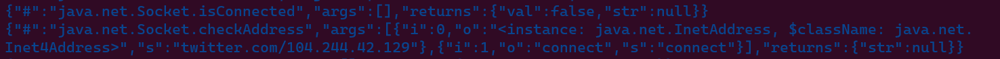


# Introduction

Anubis is an android malware or bank trojan collects sensitive data from the victim's mobile such as financial data using read/write SMS and keylogging. Anubis targets turkish speaker and spreads through malicious websites which download directly anubis malware or through google play which download the dropper then the dropper downloads the anubis malware. The sample from [VT](https://www.virustotal.com/gui/file/8cb941658ed8340b67a38a47162ab8850b89a14eee2899f0761fadd4f648fd5e/details)


# Static analysis

We try to decompile the apk file using `apktool` command `apktool d anubis.apk`. Then we open the decoded `AndroidManifest.xml` file, we see many permissions which show the capability of the malware. 

  

 <u>Figure</u>(1): permissions of the malware<u></u> 

 

The malware has the capability of access location, read/write SMS, call phone, record autio, read contacts, and internet. 

We get back to the `apk` file and `unzip` it. And convert the dalvik executable `classes.dex` file to `java bytecode` file using `dex2jar` command `d2j-dex2jar classes.dex`. Then open the classes.jar in `jd-GUI` to examine java code. 

## Uninstall the app

When trying to uninstall the program, it forces you going to home screen. Using Accessibility services run in background when [AccessibilityEvent](https://developer.android.com/reference/android/view/accessibility/AccessibilityEvent) is fired then do something. In anubis, if malware app name, settings `com.android.settings`, or remove/uninstall then go back to home screen trigaring `to_home_screen()`. 

  

 <u>Figure</u>(2): attempting to uninstall the malware<u></u> 

 

## Capabilities

The malware has a lot of Capabilities as we see VNC, keylogging, spam SMS, request location, disable play protect, and more.

  

 <u>Figure</u>(3): Malware Capabilities<u></u> 

 

## C2 server communication

By searching with `http`, we can find the C2 server `hxxp://sosyalkampanya2.tk/dedebus/` which is used as VNC client.

  

 <u>Figure</u>(4): C2 server<u></u> 

 

The malware will try to get new C2 servers, which will be through twitter. It will query the twitter page which contains Chinese tweets and search for text from two tags `苏尔的开始` and `苏尔苏尔完` then loops to convert the Chinese chars with its related in English. Then the output will be in `Base64` which will be decoded and the next output will be in `RC4` encryption and will be decrypted using key `zanibus`

  

 <u>Figure</u>(5): Get new C2 server from twitter<u></u> 

 

  

 <u>Figure</u>(6): Decode and decrypt the output<u></u> 

 

The Anubis malware android sample uses `java.net.socket` class to communicate with the C2 server. This class takes the address and the port as parameters. This class allows the mawlare to send, read data and close connections between the malware and C2 server. By using frida, we will hook the network APIs that're used. We will use two scripts, one for tracing the network APIs and another one for eavding the detection of the presence of root in our emulator. We will use frida as seen in the next figure.
We will first install Anubis malware in our emulator and its package name is `wocwvy.czyxoxmbauu.slsa`. Then we will launch frida server from our host. Then run the command that will launch the malware and hook the network APIs. 

  

 <u>Figure</u>(7): frida command to hook network APIs<u></u> 

 

The malware will check if it's connected to C2 or not. In the first check, it will return `false` because it's not connected yet. Then will return C2 server address using `CheckAddress()` method to return the address of the C2 server.  


  

 <u>Figure</u>(8): APIs that's used to connect to C2 server and get data<u></u> 

 

The malware will try to connect to the address that's returned from `CheckAddress()` which will be`Twitter/qweqweqwe` using `connect()` method. 
Then it checks if it's connected or not which will return true or false Which will return `true` because it's connected to the `Twitter/qweqweqwe`.

  

 <u>Figure</u>(9): APIs that's used to connect to C2 server and get data<u></u> 

 

  

 <u>Figure</u>(11): APIs that's used to connect to C2 server and get data<u></u> 

 

Then it will use `getInputStream` to read content of the data from `twitter` then it use `getOutputStream` to write data.

  

 <u>Figure</u>(12): APIs that's used to connect to C2 server and get data<u></u> 

 


When I reversed this sample, the malware will try to to open a connection between `twitter/qweqweqwe` using `HttpURLConnection`. 
This class will:

1. Obtain a new `HttpURLConnection` by calling `URL.openConnection()` and casting the result to `HttpURLConnection`. 

2. Transmit data by writing to the stream returned by `URLConnection.getOutputStream()`.

3. Read the response. Response headers typically include metadata such as the response body's content type and length, modified dates and session cookies. The response body may be read from the stream returned by `URLConnection.getInputStream()`. If the response has no body, that method returns an empty stream.

To get the full call graph of the malware, we will use [JEB decompiler](https://www.pnfsoftware.com/).


  

 <u>Figure</u>(13): Call graph of all malware<u></u> 

 

And this is the call graph for the methods which conatians the network communications functions.


  

 <u>Figure</u>(14): Call graph of method b<u></u> 

 

In this call graph we used [quark-engine](https://github.com/quark-engine/quark-engine).


  

 <u>Figure</u>(15): Call graph of how the method is called<u></u> 

 



## Anubis as a Keylogger

When you try to enter text in any textbox, the event `TYPE_VIEW_TEXT_CHANGED` and its event type is `16` will be triggered and save the text into `keys.log` then send it to the C2 server.

  

 <u>Figure</u>(7): Keylogging function<u></u> 


  

 <u>Figure</u>(8): If C2 sends a command contains Clear, then deletes key strokes saved<u></u> 

 

## Receiving commands

The malware receives many encrypted commands from the C2 server and then decrypts it as we see when getting new C2 server such as `opendir`, `downloadfile`, `deletefilefolder`, `getIP`. In long string of commands, commands are separated by `::`.

  

 <u>Figure</u>(9): receives encrypted commands and decryptes it<u></u> 

 

## Intercepting and forwarding Calls and SMS

The malware can Intercepting and forwarding Calls and SMS which used in bank varifications. In SMS, can forward the OTP SMS. In Calls, varification and warning calls

  

 <u>Figure</u>(10): Intercepting and forwarding Calls<u></u> 

 

## Anubis as a ransomware

The malware acts as a ransomware which can encrypt files located in `/mnt`, `/mount`, `/sdcard`, and `/storage`.

  

 <u>Figure</u>(11): Anubis as a ransomware<u></u> 

 

The malware will use RC4 encryption to encrypt the files with a key which is received from the C2 server then save the encrypted data and deletes the original data. The key is used as a decryption and encryptio data.

  

 <u>Figure</u>(12): Anubis encrypts and decrypts data<u></u> 

 

## Anubis with overlay attack

The malware searches for specific apps by comparing the installed apps to list of hardcoded apps -most of them is banking apps- to perform [overlay attack](https://encyclopedia.kaspersky.com/glossary/overlaying-overlay-attack/). The malware opens an active window over a legitimate program. The opened malicious window is the same as the legitimate program. The malware can steal the victim's credential data such as payment data or login data.

  

 <u>Figure</u>(13): Targeted apps<u></u> 


  

 <u>Figure</u>(14): Webview over the legitimate program<u></u> 

 

## Disable play protect

This is an installed malware on the device, then how it didn't flag as a malware by play protect? 
The malware disables play protect 

  

 <u>Figure</u>(15): Anubis disables play protect<u></u> 

 

# IoCs

| No.  | Description             | Hash and URLs                                                |
| :--- | ----------------------- | ------------------------------------------------------------ |
| 1    | The APK hash (MD5)      |  ba7b1ba0830e11da60dec1c90632515d                            |
| 2    | C2 server               |  hxxp://sosyalkampanya2.tk/dedebus/                          |
| 3    | related C2 Server       |  hxxp://twitter.com/qweqweqwe                                |
| 4    | related C2 Server       |  hxxp://twitter.com/ankaratakipte                            |

 
