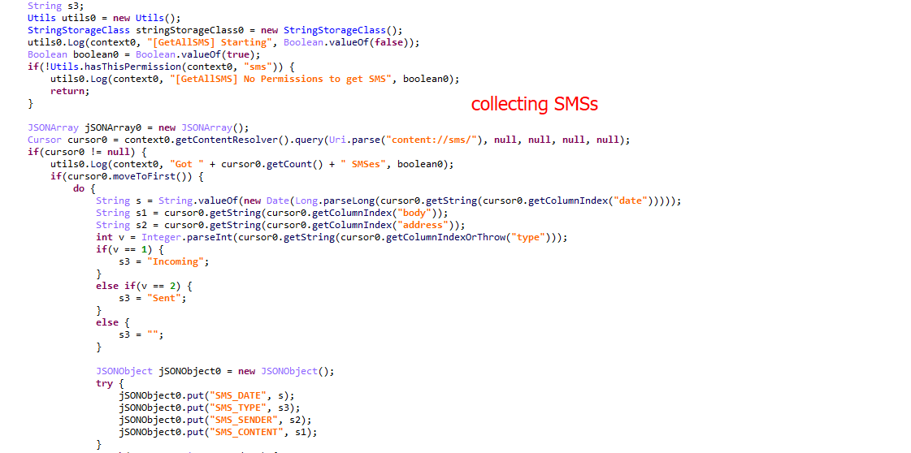

This android malware called `Cerberus` which is packed. How we know it's packed?

When we explore `AndroidManifest.xml`, we get that the Entry point of the malicious application `com.jgolmwuszameipi.paxpor.akcrpgasj` which is **not found the classes.dex**. So this an indication that the malware is packed and other classes will be loaded into application at runtime. And we need to unpack it so the malware will drop the decrypted dex file which contains the malicious functions the malware will do to the victim's device such as stealing SMS or how the malware will communicate to the C2 server.

```java
 <activity android:excludeFromRecents="true" android:icon="@drawable/vkad" android:label="" android:launchMode="2" android:name="com.jgolmwuszameipi.paxpor.iyqgm.gsqigto"/>
    <activity android:name="com.jgolmwuszameipi.paxpor.akcrpgasj">
      <intent-filter>
        <action android:name="android.intent.action.MAIN"/>
        <category android:name="android.app.role.SMS"/>
        <category android:name="android.intent.category.LAUNCHER"/>
      </intent-filter>
    </activity>
```

So we will use `Frida` to intercept `dexclassloader` because the malware will load the payload using `dexclassloader`. We will use this [script](https://github.com/cryptax/misc-code/blob/master/frida_hooks/dex-dump.js) to hook `dexclassloader` and know the payload and where the dropper droped its payload.

We then launch `Frida` with the package name which will be `com.youth.dog`.

<p align="center">
  
</p>
<br>

As you see in the last figure, the malware will drop the payload `di.json` in `/data/user/0/com.youth.dog/app_DynamicOptDex/` directory. 

All malwares share some malicous functions called `classic features`. The classic features are common malicous functions that all malwares can have in its payload such as `SMS stealing`, `contacts stealing`, `overlay attack`, and `kelogging`.

In our payload, these functions are there but when the malware collects `SMSs` or `contacts`, the malware won't send the data to its C2 server, it will send to the C2 server from our payload which wil be `http://advancedbuffs.top/`. 

<p align="center">
  
</p>
<br>

<p align="center">
  
</p>
<br>


Now we will close the malicious APK, and then delete the malicious payload `di.json` put our payload into the same directory `/data/user/0/com.youth.dog/app_DynamicOptDex/` and rename our payload as the name of the malicious payload `di.json`. 

So when we run the malware again, the malware will check if it dropped the payload or not, it will find our payload with the same name of the malicious payload. When the malware calls a malicious function, it calls from our payload.

We will start to push our `fake-payload.json` to the emulator using `adb push fake-payload.json /sdcard/`. Then we delete the malicious payload with `rm`. Then we rename the fake payload as the malicious payload, then copy our payload after we rename it to  `/data/user/0/com.youth.dog/app_DynamicOptDex/`

<p align="center">
  
</p>
<br>


As we see the malicious payload is **65 KB**. And our payload is **260 KB**.

After granting `Accessibility services` and geting the full permissions. The malware detects the existance of the emulator, the malware won't launch its malicious functions from the payload. Or the C2 server might be dead.

To get the C2 server, we will try to reverse the sample or use a [sandbox]https://tria.ge/230202-3dlrpscb5s/static1) to get the traffic from the malware and C2 server.

<p align="center">
  
</p>
<br>

After restarting the emulator, all the applications on the emulator will be truned off. Then the malware will try to run and use its payload to start its malicious function. We will check if the malware overwrite our payload or not.  

<p align="center">
  
</p>
<br>

As we see in the last figure, it's the same size of our payload.

# IoCs

Package name: `com.youth.dog`

sha256: `e31f1b158aeaf407cd7a56f87cf4c2cd13bf048db2d00b62c3da711801435839`

Payload: `di.json`

C2 server: `http://5.161.92.133`


